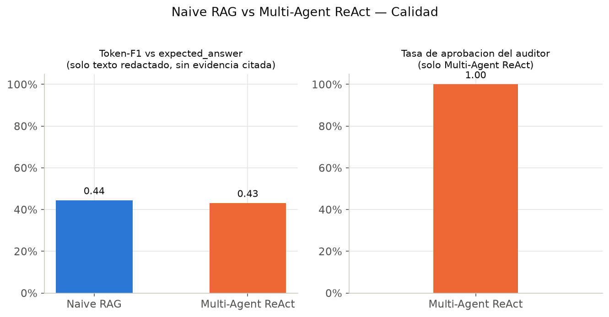
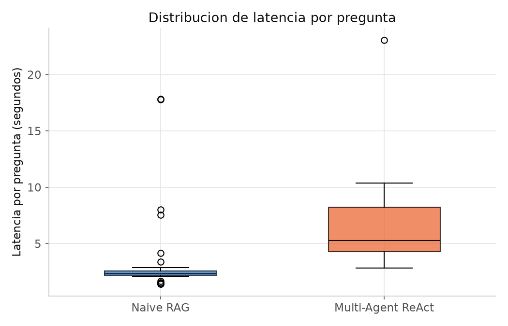

# Informe de Evaluación — Naive RAG vs. Multi-Agent ReAct

**Proyecto:** Sistema Operativo de Agentes Cognitivos para Inteligencia Competitiva (Multi-Agent ReAct con LangGraph)
**Módulo:** Evaluation Layer — comparación del baseline Naive RAG contra el sistema Multi-Agent ReAct sobre 50 consultas de WikiQA.

---

## 1. Objetivo

El enunciado del proyecto (`ENUNCIADO_PROYECTO.md`) exige una "evaluación
posterior con RAGAS o LLM-as-a-Judge, comparando contra un baseline Naive
RAG" sobre un conjunto de preguntas de evaluación. Este informe documenta
esa comparación: metodología, resultados cuantitativos, hallazgos
cualitativos y limitaciones, sobre las **50 preguntas** definidas en
`50_preguntas_wikiqa.csv`.

## 2. Metodología

### 2.1 Dataset de evaluación

`preparar_50_preguntas.py` construye `50_preguntas_wikiqa.csv` a partir del
split `test` de [WikiQA](https://huggingface.co/datasets/microsoft/wiki_qa):

1. Filtra solo preguntas con `label == 1` (tienen una respuesta correcta conocida).
2. Elimina preguntas duplicadas.
3. Muestrea 50 preguntas al azar (`random_state=42`, reproducible).
4. Conserva `question` y `answer` (renombrada `expected_answer`) como *ground truth*.

El corpus de conocimiento (ChromaDB) que usa el retriever real se construye
por separado, combinando **las tres particiones** de WikiQA (train +
validation + test, 29 258 filas → 2 811 documentos agrupados por
`document_title`), por lo que el `document_title` de cualquier pregunta del
set de test está garantizado dentro del índice.

### 2.2 Sistemas comparados

| | Naive RAG (`src/pipeline/naive_rag.py`) | Multi-Agent ReAct (`src/pipeline/multi_agent_rag.py`) |
|---|---|---|
| Pasos | 1 (retrieve + generate) | Researcher (plan + synthesize) → Fact Auditor → Writer, con ciclo de corrección hasta `MAX_ITERATIONS=2` |
| Llamadas al LLM por pregunta | 1 | 2 a 4 (según iteraciones y herramientas usadas) |
| Guardrail anti-alucinación | No | Sí (`evidence_score`, `hallucination_risk`, heurística léxica independiente) |
| Herramientas | Solo `knowledge_base_search` | `knowledge_base_search` + `web_search` (DuckDuckGo), a discreción del Researcher |

### 2.3 Configuración

- **LLM:** `gemini-2.5-flash-lite` (Google AI Studio, API real — no fallback ni modelo local).
- **Retriever:** real, `src/retriever/retrieval_pipeline.py` (WikiQA + ChromaDB + `sentence-transformers/all-MiniLM-L6-v2`), `top_k=5`.
- **Guardrail:** `MIN_EVIDENCE_SCORE=0.70`, `MAX_HALLUCINATION_RISK=0.30`, `MAX_ITERATIONS=2` (`config/settings.yaml`).
- **Ejecución:** [`evaluation/run_batch.py`](evaluation/run_batch.py), resumible por pregunta, con rotación automática entre varias API keys para sortear el free tier de Gemini (ver §5).

### 2.4 Métricas

Se optó por métricas **propias, sin costo adicional de API** en vez de
RAGAS/LLM-as-a-Judge (ver §6, Limitaciones, sobre por qué RAGAS quedó
fuera de esta corrida):

- **Latencia** (`latency_seconds`): tiempo de una llamada exitosa a `naive_rag()` / `multi_agent_rag()`.
- **Correctness — Token-F1 vs. `expected_answer`**: F1 de solapamiento de tokens (sin stopwords) entre la respuesta y la respuesta esperada de WikiQA. Se calcula sobre el **texto redactado por el modelo únicamente** (`extract_core_answer()` en `evaluation/metrics.py`), excluyendo el bloque "Evidencia usada:" que el Writer agrega en Multi-Agent ReAct — incluir ese bloque compara contra contexto crudo repetido, no contra texto generado, y penaliza injustamente a quien cita más evidencia (ver nota metodológica más abajo).
- **Guardrail propio** (solo Multi-Agent ReAct): `evidence_score`, `hallucination_risk`, `audit_passed`, `iterations`.
- **Cobertura de recuperación:** número de chunks de contexto usados.

## 3. Resultados

50/50 preguntas resueltas sin error en ambos sistemas.

| Métrica | Naive RAG | Multi-Agent ReAct |
|---|---:|---:|
| Preguntas sin error | 50/50 | 50/50 |
| Latencia promedio | **3.17 s** | **6.32 s** (+99%) |
| Correctness (Token-F1 vs. `expected_answer`, core)¹ | **0.444** | **0.431** |
| Longitud de respuesta (solo texto redactado) | 187 caracteres | 414 caracteres |
| Chunks de contexto usados (promedio) | 5.00 | 4.14 |
| `evidence_score` promedio | no aplica | 0.956 |
| `hallucination_risk` promedio | no aplica | 0.044 |
| Tasa de aprobación del auditor | no aplica | 100% (50/50) |
| Iteraciones promedio | 1.0 (fijo) | 1.0 |

¹ Diferencia **no significativa** (prueba pareada, `p>0.7`) — pero el
promedio esconde un patrón real por subgrupo, ver §4.1.






## 4. Análisis

### 4.1 El "empate" en el agregado esconde dos efectos opuestos que se cancelan

El Token-F1 promedio es casi idéntico (0.444 vs. 0.431, diferencia de
−0.013). Antes de interpretar esto como "da lo mismo", se corrió la prueba
estadística correspondiente para un diseño **pareado** (misma pregunta,
dos sistemas): **t de Student pareada** (`t=−0.287, p=0.775`) y
**Wilcoxon signed-rank** (`p=0.992`, no paramétrica, más apropiada dado que
la distribución de Token-F1 no es normal). Ninguna rechaza la hipótesis
nula de que no hay diferencia — con `n=50` el test tiene poca potencia
para detectar diferencias chicas, pero al menos descarta que el promedio
esté escondiendo una ventaja grande y sistemática de un sistema sobre el
otro. Por pregunta: Multi-Agent superó a Naive en 26/50, Naive superó a
Multi-Agent en 22/50, empate técnico en 2/50 — repartido, no dominado por
ninguno de los dos.

Pero el promedio sí esconde algo real, solo que no es "quién gana": son
**dos subgrupos con comportamientos opuestos**. Se identificaron las
preguntas donde Naive RAG usa lenguaje de "evidencia insuficiente" (p.ej.
*"does not contain information..."*) — **9 de 50 (18%)** — y se separó el
resto:

| Subgrupo | n | Naive: Token-F1 (core) | Multi-Agent: Token-F1 (core) |
|---|---:|---:|---:|
| Naive se rinde (contexto de KB local insuficiente) | 9 | 0.093 | **0.352** |
| Naive sí intenta responder | 41 | **0.521** | 0.449 |

- **Cuando el contexto local no alcanza, Multi-Agent gana claramente**
  (0.352 vs. 0.093, ~3.8x): el Researcher puede recurrir a `web_search`
  cuando la base de conocimiento local no tiene la respuesta, algo que
  Naive RAG no puede hacer (solo usa `knowledge_base_search`). En las 9
  preguntas de este subgrupo, el auditor aprobó la respuesta de
  Multi-Agent en las 9 (`evidence_score ≥ 0.70`). Ejemplo:

  > **Pregunta:** *"what became of rich on price is right"*
  > **Naive RAG:** *"...It does not contain information about what became of him after that period."*
  > **Multi-Agent ReAct:** *"...Fields is currently a meteorologist for the CBS owned and operated television stations KCBS-TV and KCAL-TV..."* (`evidence_score=1.0`)

- **Cuando Naive sí tiene con qué responder, es más preciso que
  Multi-Agent** (0.521 vs. 0.449): probablemente porque sus respuestas son
  más cortas y directas (187 caracteres en promedio) frente al estilo más
  verboso y matizado del Writer Agent (414 caracteres core en promedio),
  lo que diluye la precisión léxica del Token-F1 aunque el contenido sea
  igualmente correcto.

**Conclusión de esta sección:** el promedio global (0.444 vs. 0.431) es
casualmente parecido porque estos dos efectos —Multi-Agent gana cuando
hace falta buscar más allá del contexto local, Naive gana en precisión
cuando no hace falta— tienen magnitud similar y se cancelan. No es
evidencia de que ambos sistemas "hagan lo mismo"; es evidencia de que
**resuelven distinto tipo de preguntas mejor**, y eso es más relevante
para decidir cuándo usar cada uno que un promedio único.

### 4.2 El costo es ~2x latencia

6.32 s vs. 3.17 s por pregunta, explicado por el número de llamadas al LLM
(Naive: 1; Multi-Agent: entre 2 y 4, plan + synthesize del Researcher, más
posibles llamadas a herramientas). Es el costo esperado y documentado del
diseño: más pasos de razonamiento y verificación a cambio de guardrails.

### 4.3 El guardrail aprobó el 100% de las preguntas — es plausible, no un error

Ninguna de las 50 preguntas disparó el ciclo de rechazo/corrección. Se
verificó que esto **no es un guardrail vacío**: `evidence_score` tuvo un
rango real de **0.70 a 1.00** (media 0.956, desvío estándar 0.077), y al
menos una pregunta aprobó justo en el límite del umbral:

> **Pregunta:** *"when was How the west was won filmed?"*
> **`evidence_score`:** exactamente **0.70** (el umbral de aprobación es `< 0.70` rechaza — pasó raspando).

Si esa respuesta hubiera tenido un token menos de solapamiento léxico con
el contexto, se habría disparado el ciclo de corrección. La razón por la
que el guardrail aprueba tan consistentemente es que el Researcher redacta
de forma **extractiva** (parafrasea muy cerca del contexto recuperado), lo
cual encaja naturalmente con una heurística de solapamiento de vocabulario.
Esto es una propiedad conocida del diseño (ver §6), no evidencia de que el
guardrail sea inútil.

### 4.4 Nota metodológica: por qué se excluyó el bloque de evidencia del Token-F1

El Writer Agent construye la respuesta final con el formato:

```
Respuesta final:
<texto redactado por el modelo>

Evidencia usada:
- <chunk de contexto recuperado, ~1200 caracteres c/u>
...

Nivel de confianza:
...
```

Calcular Token-F1 contra ese bloque completo (incluyendo "Evidencia
usada") da **0.106** en vez de 0.431 — una caída artificial de ~76% que no
refleja peor calidad de respuesta, sino que el bloque de evidencia diluye
el solapamiento léxico con texto que el modelo ni siquiera redactó (es el
contexto recuperado, citado tal cual). La longitud de respuesta promedio
sin filtrar (4 819 caracteres) frente a la longitud del texto redactado
(414 caracteres) confirma esto: **~91% del texto de la respuesta "cruda"
es evidencia citada, no contenido generado.** Ambas métricas (cruda y
"core") quedan calculadas en `outputs/evaluation_ready/comparison_metrics.csv`
para transparencia, pero la comparación válida entre sistemas es la "core".

## 5. Nota operativa: cuota de la API de Gemini

El free tier de una sola API key de Google AI Studio resultó insuficiente
para este batch (~250 llamadas entre ambos sistemas): se observaron límites
tanto diarios (20 requests/día/modelo) como por minuto (10 requests/min).
La solución implementada fue repartir el trabajo entre **7 API keys
personales** (una por integrante del equipo, sin costo) con rotación
automática en [`evaluation/run_batch.py`](evaluation/run_batch.py)/[`evaluation/key_rotation.py`](evaluation/key_rotation.py):
ante un error de cuota, el sistema prueba la siguiente key sin repetir
trabajo ya hecho, y si las 7 se agotan en ráfaga espera ~65 s y reintenta
desde la primera (recuperación típica de límites por minuto) antes de
darse por vencido. El batch completo se resolvió sin pérdida de datos
gracias a este mecanismo. Detalle en `docs/evaluation_how_to_run.md`.

## 6. Limitaciones

- **`evidence_score` / `hallucination_risk` son una heurística léxica**, no
  un juicio semántico (NLI o LLM-as-a-Judge). Mide superposición de
  vocabulario entre respuesta y contexto, lo cual premia sistemáticamente
  respuestas extractivas y no detectaría, por ejemplo, una respuesta que
  reordene o interprete mal información usando las mismas palabras del
  contexto.
- **El ciclo de rechazo/corrección no se observó con el LLM real** en esta
  corrida — está implementado y probado en modo fallback/unitario
  (`src/agents/auditor.py`, `docs/architecture.md`), pero las 50 preguntas
  reales aprobaron todas en la primera iteración. Queda pendiente forzarlo
  deliberadamente (preguntas más ambiguas, o bajar el umbral) para
  demostrarlo en vivo.
- **No se corrió RAGAS ni LLM-as-a-Judge** (faithfulness, answer_relevancy,
  context_precision), que es lo que pide formalmente el enunciado además
  del baseline. El Token-F1 propio es un proxy razonable y gratuito, pero
  no lo reemplaza. `evaluation/metrics.py --with-ragas` está implementado
  y listo para correr si se dispone de más cuota de API.
- **Token-F1 es un proxy de correctness, no una medida de calidad
  completa**: no captura fluidez, concisión ni si la respuesta agrega
  contexto útil no presente en `expected_answer` (que en WikiQA suele ser
  una sola oración corta).

## 7. Conclusiones

1. **En el agregado, Naive RAG y Multi-Agent ReAct tienen correctness
   estadísticamente indistinguible** (0.444 vs. 0.431 Token-F1; prueba
   pareada `p>0.7` en ambos tests) — pero ese empate esconde una
   diferencia real y explicable: **Multi-Agent gana con ventaja clara
   (0.352 vs. 0.093, ~3.8x) en el 18% de las preguntas donde el contexto
   local no alcanza** y hace falta `web_search`, mientras que **Naive es
   más preciso (0.521 vs. 0.449) en el 82% restante**, donde ambos tienen
   suficiente contexto. La elección entre uno y otro depende de si el
   caso de uso prioriza cobertura (preguntas fuera del corpus local) o
   precisión/velocidad (preguntas bien cubiertas por el corpus).
2. El costo de la mayor cobertura de Multi-Agent es **~2x latencia** (6.32 s
   vs. 3.17 s por pregunta), producto de las llamadas adicionales al LLM
   del ciclo Researcher → Auditor → Writer, y proporcionalmente más
   consumo de cuota de API (2-4 llamadas/pregunta vs. 1).
3. El guardrail cuantitativo funciona como está diseñado (rango real
   0.70–1.00, con casos al borde del umbral), aunque en esta muestra de 50
   preguntas nunca llegó a rechazar un borrador — probablemente porque el
   estilo extractivo del Researcher encaja bien con una heurística léxica.
   Al ser la misma heurística la que decide "aprobado" y la que se reporta
   como evidencia de calidad, este resultado debe leerse como **coherencia
   interna del guardrail**, no como una validación semántica independiente
   de que las respuestas no tienen alucinaciones.
4. Para una evaluación más completa alineada 100% con el enunciado, el
   siguiente paso es correr RAGAS/LLM-as-a-Judge (para tener una medida
   semántica independiente que confirme o corrija la lectura del Token-F1)
   y forzar al menos un caso real de rechazo/corrección del auditor con el
   LLM real.

## 8. Reproducibilidad

```bash
python -m evaluation.run_batch --system both   # correr ambos sistemas sobre las 50 preguntas
python -m evaluation.metrics                   # metricas + analisis pareado -> comparison_metrics.csv, significance_analysis.json
python -m evaluation.report                    # tablas + graficos -> outputs/evaluation_ready/report/
```

`evaluation/metrics.py` calcula automáticamente el test pareado (t de
Student + Wilcoxon) y el desglose por subgrupo (§4.1) en
`outputs/evaluation_ready/significance_analysis.json` — los números de
este informe no son un análisis manual desconectado del código, se
reproducen corriendo el pipeline.

Detalle completo, incluyendo la rotación de API keys, en
[`docs/evaluation_how_to_run.md`](docs/evaluation_how_to_run.md).
