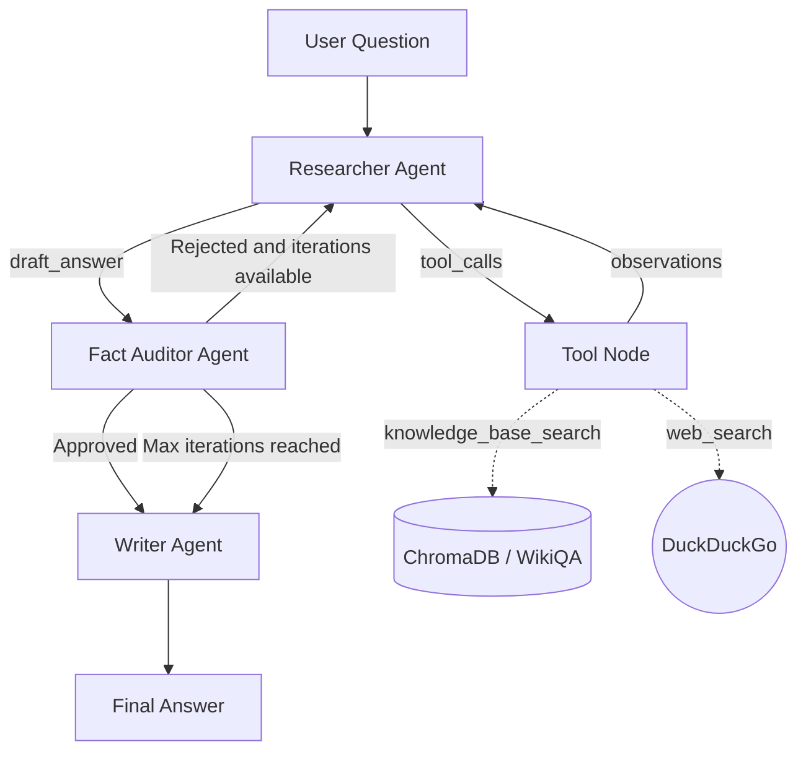
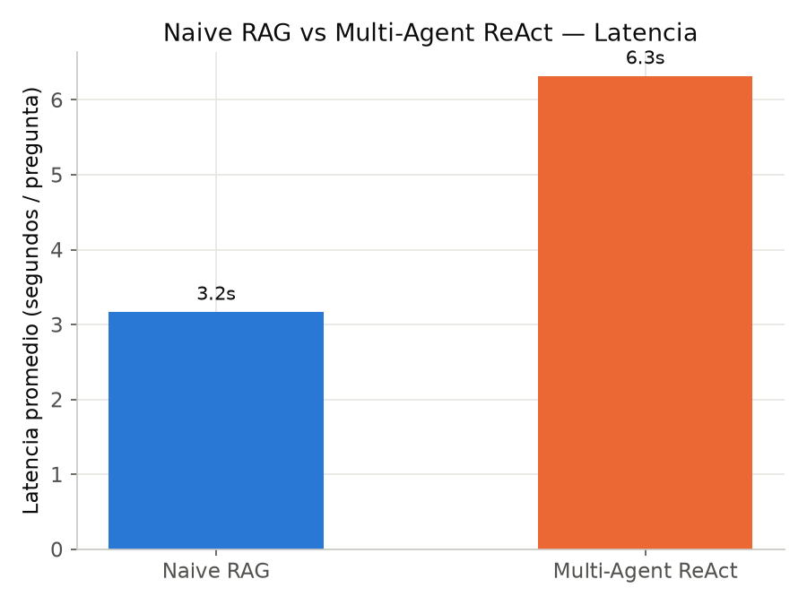

# Sistema Operativo de Agentes Cognitivos para Inteligencia Competitiva

**Multi-Agent ReAct con LangGraph** — Proyecto final de Arquitecturas de Modelos de Lenguaje.

Este repositorio implementa un sistema multi-agente autónomo basado en
ReAct, orquestado con LangGraph, sobre una base vectorial local (WikiQA) con
guardrails contra alucinaciones. El texto oficial del enunciado vive en
[`ENUNCIADO_PROYECTO.md`](ENUNCIADO_PROYECTO.md).

## Descripción

El sistema recibe una pregunta del usuario y la procesa mediante tres
agentes cooperando en un grafo de estados:

1. **Researcher Agent** recibe la pregunta del usuario y decide recupera evidencia de una base vectorial o de una búsqueda con DuckDuckGo y redacta un borrador de respuesta apoyado solo en esa evidencia.
2. **Fact Auditor Agent** evalúa cuantitativamente si el borrador está
   sustentado en el contexto (`evidence_score`, `hallucination_risk`) y
   decide aprobar, rechazar (volver al Researcher) o forzar el paso al
   Writer si se agotaron las iteraciones.
3. **Writer Agent** produce la respuesta final con evidencia citada, nivel
   de confianza y advertencias si corresponde.

Todo el flujo queda trazado con eventos ReAct (`Thought -> Action ->
Observation`) y el resultado se exporta en un formato listo para evaluación
con RAGAS / LLM-as-a-Judge.

## Arquitectura general

El proyecto está organizado en tres capas conceptuales:

| Capa | Responsabilidad |
|------|------------------|
| **Data & Retrieval Layer** | Dataset (WikiQA), embeddings, base vectorial (FAISS/ChromaDB), `retrieve_context()`, baseline Naive RAG. |
| **Multi-Agent Orchestration Layer** (este repositorio) | `AgentState`, Researcher/Fact Auditor/Writer Agents, grafo LangGraph, guardrails, trazabilidad, `multi_agent_rag()`. |
| **Evaluation Layer** | Evaluación de 50 consultas con RAGAS (Faithfulness, Answer Relevance, Context Precision), comparación Multi-Agent ReAct vs. Naive RAG. |

```
                 ┌───────────────────────────────────────────────┐
                 │              LangGraph StateGraph              │
                 │                                                 │
 pregunta ──────►│  researcher ──► auditor ──► route_after_audit   │
                 │      ▲               │        │      │          │
                 │      └───────────────┘        │      └──► writer│──► respuesta final
                 │   (rechazado, quedan          │  (aprobado o        + trace + eval_format
                 │      iteraciones)             │   max_iterations)
                 └───────────────────────────────────────────────┘
                          ▲                                    │
                          │ retrieve_context()                 │ convert_to_eval_format()
                          │                                    ▼
                 ┌──────────────────────┐              ┌──────────────────┐
                 │ Data & Retrieval     │              │ Evaluation Layer  │
                 │ Layer                │              │ RAGAS /           │
                 │ WikiQA + FAISS/Chroma│              │ LLM-as-a-Judge    │
                 │ Naive RAG baseline   │              │ vs Naive RAG      │
                 └──────────────────────┘              └──────────────────┘
```

Diagrama Mermaid del grafo interno (también en `docs/architecture.md`):


## Data & Retrieval Layer

Se utilizó el corpus público [WikiQA](https://huggingface.co/datasets/microsoft/wiki_qa) disponible en Hugging Face. Las columnas del dataset son:

* `question`: pregunta

* `question_id`: id de la pregunta

* `document_title`: título del documento

* `answer`: respuesta candidata para la pregunta

* `label`: etiqueta 0/1 que indica si la respuesta responde a la pregunta

Para cada `document_title` hay varias `answer`. Cada `answer` es bastante corta por lo que para la vectorización se optó por concatenar todos los `answers` que pertenecen a un mismo `document_title` y vectorizarlo como un único chunk. El código de creación de la base de conocimiento está en `src/retriever/retrieval_pipeline`.

- Se usó el modelo [`sentence-transformers/all-MiniLM-L6-v2` disponible en Hugging Face](https://huggingface.co/sentence-transformers/all-MiniLM-L6-v2) para vectorizar cada documento resultante. Los resultados tienen 384 dimensiones.

- Se usó la base de datos vectorial ChromaDB.


## Multi-Agent Orchestration Layer

- Grafo LangGraph con 3 nodos (`researcher`, `auditor`, `writer`) y una
  arista condicional (`route_after_audit`).
- `AgentState` tipado (`TypedDict`) compartido entre nodos.
- Guardrails cuantitativos independientes del LLM (`evidence_score`,
  `hallucination_risk`) con umbrales configurables.
- Ciclo de rechazo y corrección acotado por `MAX_ITERATIONS`.
- Trazabilidad ReAct corta y auditable en cada nodo.
- Interfaces desacopladas para retriever y LLM: **modo fallback** (desarrollo
  aislado, sin dependencias externas) y **modo real** (Data & Retrieval
  Layer / LLM local o Gemini).
- Salida estructurada lista para `convert_to_eval_format()` (Evaluation Layer).

## LLM: local, fallback o Gemini — no depende de una sola API

El enunciado prioriza inferencia local con un modelo mediano cuantizado
(Mistral-7B-Instruct o Llama-3-8B-Instruct en 4 bits). Por eso el módulo
expone una interfaz única, `generate_llm_response(prompt)`
(`src/llm/interface.py`), resuelta por `provider`:

| provider   | Módulo                    | Uso |
|------------|---------------------------|-----|
| `fallback` | `src/llm/fallback_llm.py` | Pruebas rápidas, sin GPU ni API keys (default). |
| `local`    | `src/llm/local_llm.py`    | **Modo principal de arquitectura**: Mistral-7B/Llama-3-8B cuantizado 4-bit. |
| `gemini`   | `src/llm/gemini_llm.py`   | Opcional, para desarrollo rápido sin GPU. |

Ningún agente importa un backend concreto: todos resuelven el proveedor
activo en `src/llm/interface.py::resolve_llm`. Gemini nunca es la única
opción del sistema.

## Instalación

```bash
git clone https://github.com/anamariaaccilio/pln-multi-agent-react-orchestrator.git
cd p2_multi-agent-react-orchestrator
python -m venv .venv && source .venv/bin/activate   # opcional
pip install -r requirements.txt
```

## Cómo correr — comandos exactos

**Terminal (rápido, modo fallback):**

```bash
python examples/run_multi_agent_demo.py
```

**Otros examples:**

```bash
python examples/integration_example_retriever.py
python examples/export_eval_format_demo.py
```

**Notebook (entrega):**

Abrir `notebooks/02_multi_agent_langgraph_pipeline.ipynb` en Jupyter, VS
Code o Google Colab. Importa todo desde `src/`, no duplica lógica.

Guía detallada paso a paso: [`docs/how_to_run.md`](docs/how_to_run.md).

```python
from src.retriever.interface import register_retriever, initialize
from retrieval_pipeline import retrieve_context  # función del Data & Retrieval Layer

register_retriever(retrieve_context)
initialize()

# construir grafo

from src.graph.build_graph import build_agent_graph
from src.graph.visualize import visualize_graph

compiled_graph = build_agent_graph()
print(visualize_graph(compiled_graph))

# llamar al sistema


from src.pipeline.multi_agent_rag import multi_agent_rag
result = multi_agent_rag("...", retriever=retrieve_context)
```

## Cómo entregar output al Evaluation Layer

```python
from src.pipeline.eval_format import convert_to_eval_format
eval_item = convert_to_eval_format(result)
```

Devuelve:

```python
{
    "question": "...",
    "answer": "...",
    "contexts": ["...", "..."],
    "system_type": "multi_agent_react",
    "audit_passed": True,
    "evidence_score": 0.82,
    "hallucination_risk": 0.18,
}
```

Detalle completo en [`docs/evaluation_interface.md`](docs/evaluation_interface.md).

## Estructura de carpetas

```
PLN_P2/
├── README.md
├── requirements.txt
├── .gitignore
├── ENUNCIADO_PROYECTO.md
├── config/settings.yaml
├── notebooks/
│   └── 02_multi_agent_langgraph_pipeline.ipynb
├── src/
│   ├── config.py
│   ├── agents/{state.py, prompts.py, researcher.py, auditor.py, writer.py}
│   ├── graph/{routes.py, build_graph.py, visualize.py}
│   ├── pipeline/{multi_agent_rag.py, eval_format.py}
│   ├── retriever/{interface.py, fallback_retriever.py}
│   ├── llm/{interface.py, fallback_llm.py, local_llm.py, gemini_llm.py}
│   └── utils/{trace.py, formatting.py}
├── examples/
│   ├── run_multi_agent_demo.py
│   ├── integration_example_retriever.py
│   └── export_eval_format_demo.py
├── outputs/{traces/, graph/, evaluation_ready/}
└── docs/{architecture.md, integration_with_retriever.md, evaluation_interface.md,
         how_to_run.md, defense_script.md, troubleshooting.md}
```

## Ejemplo de uso

```python
from src.pipeline.multi_agent_rag import multi_agent_rag
from src.pipeline.eval_format import convert_to_eval_format
from src.utils.trace import print_trace

result = multi_agent_rag("Cuando y por quien fue construida la Torre Eiffel?")

print(result["final_answer"])
print_trace(result)
print(convert_to_eval_format(result))
```

## Output esperado

```python
{
    "question": "Cuando y por quien fue construida la Torre Eiffel?",
    "retrieved_context": [{"content": "...", "source": "wikiqa_doc_0142", "score": 0.91}, ...],
    "draft_answer": "...",
    "audit_passed": True,
    "audit_feedback": "Aprobado: la respuesta esta razonablemente sustentada en el contexto.",
    "missing_info": "",
    "final_answer": "Respuesta final:\n...\n\nEvidencia usada:\n...\n\nNivel de confianza:\nAlto\n\nAdvertencia:\nNinguna.",
    "iterations": 1,
    "trace": [{"agent": "researcher", "thought": "...", "action": "...", "observation": "..."}, ...],
    "evidence_score": 0.82,
    "hallucination_risk": 0.18,
    "confidence_level": "Alto",
    "warnings": [],
    "system_type": "multi_agent_react",
}
```

## Métricas de evaluación

- **Propias del guardrail (Multi-Agent Orchestration Layer):** `evidence_score`,
  `hallucination_risk`, `audit_passed`, número de `iterations` usadas.
- **Externas (Evaluation Layer, vía `convert_to_eval_format`):** Faithfulness,
  Answer Relevance, Context Precision (RAGAS) o un score de LLM-as-a-Judge,
  comparadas contra el mismo set de preguntas corrido en el baseline Naive RAG.

## Evaluación: Naive RAG vs. Multi-Agent ReAct (50 preguntas WikiQA)

El enunciado del proyecto (`ENUNCIADO_PROYECTO.md`) exige una "evaluación
posterior con RAGAS o LLM-as-a-Judge, comparando contra un baseline Naive
RAG" sobre un conjunto de preguntas de evaluación. Esta sección documenta
esa comparación: metodología, resultados cuantitativos, hallazgos
cualitativos y limitaciones, sobre las **50 preguntas** definidas en
`50_preguntas_wikiqa.csv`.

### Metodología de la evaluación

#### Dataset de evaluación

`preparar_50_preguntas.py` construye `50_preguntas_wikiqa.csv` a partir del
split `test` de [WikiQA](https://huggingface.co/datasets/microsoft/wiki_qa):

1. Filtra solo preguntas con `label == 1` (tienen una respuesta correcta conocida).
2. Elimina preguntas duplicadas.
3. Muestrea 50 preguntas al azar (`random_state=42`, reproducible).
4. Conserva `question` y `answer` (renombrada `expected_answer`) como *ground truth*.

El corpus de conocimiento (ChromaDB) que usa el retriever real se construye
por separado, combinando **las tres particiones** de WikiQA (train +
validation + test, 29 258 filas → 2 811 documentos agrupados por
`document_title`), por lo que el `document_title` de cualquier pregunta del
set de test está garantizado dentro del índice.

#### Sistemas comparados

| | Naive RAG (`src/pipeline/naive_rag.py`) | Multi-Agent ReAct (`src/pipeline/multi_agent_rag.py`) |
|---|---|---|
| Pasos | 1 (retrieve + generate) | Researcher (plan + synthesize) → Fact Auditor → Writer, con ciclo de corrección hasta `MAX_ITERATIONS=2` |
| Llamadas al LLM por pregunta | 1 | 2 a 4 (según iteraciones y herramientas usadas) |
| Guardrail anti-alucinación | No | Sí (`evidence_score`, `hallucination_risk`, heurística léxica independiente) |
| Herramientas | Solo `knowledge_base_search` | `knowledge_base_search` + `web_search` (DuckDuckGo), a discreción del Researcher |

#### Configuración

- **LLM:** `gemini-2.5-flash-lite` (Google AI Studio, API real — no fallback ni modelo local).
- **Retriever:** real, `src/retriever/retrieval_pipeline.py` (WikiQA + ChromaDB + `sentence-transformers/all-MiniLM-L6-v2`), `top_k=5`.
- **Guardrail:** `MIN_EVIDENCE_SCORE=0.70`, `MAX_HALLUCINATION_RISK=0.30`, `MAX_ITERATIONS=2` (`config/settings.yaml`).
- **Ejecución:** [`evaluation/run_batch.py`](evaluation/run_batch.py), resumible por pregunta, con rotación automática entre varias API keys para sortear el free tier de Gemini (ver "Nota operativa" más abajo).

#### Métricas usadas

Se optó por métricas **propias, sin costo adicional de API** en vez de
RAGAS/LLM-as-a-Judge (ver "Limitaciones de la evaluación" sobre por qué
RAGAS quedó fuera de esta corrida):

- **Latencia** (`latency_seconds`): tiempo de una llamada exitosa a `naive_rag()` / `multi_agent_rag()`.
- **Correctness — Token-F1 vs. `expected_answer`**: F1 de solapamiento de tokens (sin stopwords) entre la respuesta y la respuesta esperada de WikiQA. Se calcula sobre el **texto redactado por el modelo únicamente** (`extract_core_answer()` en `evaluation/metrics.py`), excluyendo el bloque "Evidencia usada:" que el Writer agrega en Multi-Agent ReAct — incluir ese bloque compara contra contexto crudo repetido, no contra texto generado, y penaliza injustamente a quien cita más evidencia (ver nota metodológica más abajo).
- **Guardrail propio** (solo Multi-Agent ReAct): `evidence_score`, `hallucination_risk`, `audit_passed`, `iterations`.
- **Cobertura de recuperación:** número de chunks de contexto usados.

### Resultados

50/50 preguntas resueltas sin error en ambos sistemas.

| Métrica | Naive RAG | Multi-Agent ReAct |
|---|---:|---:|
| Preguntas sin error | 50/50 | 50/50 |
| Latencia promedio | **3.17 s** | **6.32 s** (+99%) |
| Correctness (Token-F1 vs. `expected_answer`, core)¹ | **0.444** | **0.431** |
| Longitud de respuesta (solo texto redactado) | 187 caracteres | 414 caracteres |
| Chunks de contexto usados (promedio) | 5.00 | 4.14 |
| `evidence_score` promedio | no aplica | 0.956 |
| `hallucination_risk` promedio | no aplica | 0.044 |
| Tasa de aprobación del auditor | no aplica | 100% (50/50) |
| Iteraciones promedio | 1.0 (fijo) | 1.0 |

¹ Diferencia **no significativa** (prueba pareada, `p>0.7`) — pero el
promedio esconde un patrón real por subgrupo, ver más abajo.




### Análisis

#### El "empate" en el agregado esconde dos efectos opuestos que se cancelan

El Token-F1 promedio es casi idéntico (0.444 vs. 0.431, diferencia de
−0.013). Antes de interpretar esto como "da lo mismo", se corrió la prueba
estadística correspondiente para un diseño **pareado** (misma pregunta,
dos sistemas): **t de Student pareada** (`t=−0.287, p=0.775`) y
**Wilcoxon signed-rank** (`p=0.992`, no paramétrica, más apropiada dado que
la distribución de Token-F1 no es normal). Ninguna rechaza la hipótesis
nula de que no hay diferencia — con `n=50` el test tiene poca potencia
para detectar diferencias chicas, pero al menos descarta que el promedio
esté escondiendo una ventaja grande y sistemática de un sistema sobre el
otro. Por pregunta: Multi-Agent superó a Naive en 26/50, Naive superó a
Multi-Agent en 22/50, empate técnico en 2/50 — repartido, no dominado por
ninguno de los dos.

Pero el promedio sí esconde algo real, solo que no es "quién gana": son
**dos subgrupos con comportamientos opuestos**. Se identificaron las
preguntas donde Naive RAG usa lenguaje de "evidencia insuficiente" (p.ej.
*"does not contain information..."*) — **9 de 50 (18%)** — y se separó el
resto:

| Subgrupo | n | Naive: Token-F1 (core) | Multi-Agent: Token-F1 (core) |
|---|---:|---:|---:|
| Naive se rinde (contexto de KB local insuficiente) | 9 | 0.093 | **0.352** |
| Naive sí intenta responder | 41 | **0.521** | 0.449 |

- **Cuando el contexto local no alcanza, Multi-Agent gana claramente**
  (0.352 vs. 0.093, ~3.8x): el Researcher puede recurrir a `web_search`
  cuando la base de conocimiento local no tiene la respuesta, algo que
  Naive RAG no puede hacer (solo usa `knowledge_base_search`). En las 9
  preguntas de este subgrupo, el auditor aprobó la respuesta de
  Multi-Agent en las 9 (`evidence_score ≥ 0.70`). Ejemplo:

  > **Pregunta:** *"what became of rich on price is right"*
  > **Naive RAG:** *"...It does not contain information about what became of him after that period."*
  > **Multi-Agent ReAct:** *"...Fields is currently a meteorologist for the CBS owned and operated television stations KCBS-TV and KCAL-TV..."* (`evidence_score=1.0`)

- **Cuando Naive sí tiene con qué responder, es más preciso que
  Multi-Agent** (0.521 vs. 0.449): probablemente porque sus respuestas son
  más cortas y directas (187 caracteres en promedio) frente al estilo más
  verboso y matizado del Writer Agent (414 caracteres core en promedio),
  lo que diluye la precisión léxica del Token-F1 aunque el contenido sea
  igualmente correcto.

**Conclusión de esta sección:** el promedio global (0.444 vs. 0.431) es
casualmente parecido porque estos dos efectos —Multi-Agent gana cuando
hace falta buscar más allá del contexto local, Naive gana en precisión
cuando no hace falta— tienen magnitud similar y se cancelan. No es
evidencia de que ambos sistemas "hagan lo mismo"; es evidencia de que
**resuelven distinto tipo de preguntas mejor**, y eso es más relevante
para decidir cuándo usar cada uno que un promedio único.

#### El costo es ~2x latencia

6.32 s vs. 3.17 s por pregunta, explicado por el número de llamadas al LLM
(Naive: 1; Multi-Agent: entre 2 y 4, plan + synthesize del Researcher, más
posibles llamadas a herramientas). Es el costo esperado y documentado del
diseño: más pasos de razonamiento y verificación a cambio de guardrails.

#### El guardrail aprobó el 100% de las preguntas — es plausible, no un error

Ninguna de las 50 preguntas disparó el ciclo de rechazo/corrección. Se
verificó que esto **no es un guardrail vacío**: `evidence_score` tuvo un
rango real de **0.70 a 1.00** (media 0.956, desvío estándar 0.077), y al
menos una pregunta aprobó justo en el límite del umbral:

> **Pregunta:** *"when was How the west was won filmed?"*
> **`evidence_score`:** exactamente **0.70** (el umbral de aprobación es `< 0.70` rechaza — pasó raspando).

Si esa respuesta hubiera tenido un token menos de solapamiento léxico con
el contexto, se habría disparado el ciclo de corrección. La razón por la
que el guardrail aprueba tan consistentemente es que el Researcher redacta
de forma **extractiva** (parafrasea muy cerca del contexto recuperado), lo
cual encaja naturalmente con una heurística de solapamiento de vocabulario.
Esto es una propiedad conocida del diseño (ver "Limitaciones de la
evaluación" más abajo), no evidencia de que el guardrail sea inútil.

#### Nota metodológica: por qué se excluyó el bloque de evidencia del Token-F1

El Writer Agent construye la respuesta final con el formato:

```
Respuesta final:
<texto redactado por el modelo>

Evidencia usada:
- <chunk de contexto recuperado, ~1200 caracteres c/u>
...

Nivel de confianza:
...
```

Calcular Token-F1 contra ese bloque completo (incluyendo "Evidencia
usada") da **0.106** en vez de 0.431 — una caída artificial de ~76% que no
refleja peor calidad de respuesta, sino que el bloque de evidencia diluye
el solapamiento léxico con texto que el modelo ni siquiera redactó (es el
contexto recuperado, citado tal cual). La longitud de respuesta promedio
sin filtrar (4 819 caracteres) frente a la longitud del texto redactado
(414 caracteres) confirma esto: **~91% del texto de la respuesta "cruda"
es evidencia citada, no contenido generado.** Ambas métricas (cruda y
"core") quedan calculadas en `outputs/evaluation_ready/comparison_metrics.csv`
para transparencia, pero la comparación válida entre sistemas es la "core".

### Nota operativa: cuota de la API de Gemini

El free tier de una sola API key de Google AI Studio resultó insuficiente
para este batch (~250 llamadas entre ambos sistemas): se observaron límites
tanto diarios (20 requests/día/modelo) como por minuto (10 requests/min).
La solución implementada fue repartir el trabajo entre **7 API keys
personales** (una por integrante del equipo, sin costo) con rotación
automática en [`evaluation/run_batch.py`](evaluation/run_batch.py)/[`evaluation/key_rotation.py`](evaluation/key_rotation.py):
ante un error de cuota, el sistema prueba la siguiente key sin repetir
trabajo ya hecho, y si las 7 se agotan en ráfaga espera ~65 s y reintenta
desde la primera (recuperación típica de límites por minuto) antes de
darse por vencido. El batch completo se resolvió sin pérdida de datos
gracias a este mecanismo. Detalle en `docs/evaluation_how_to_run.md`.

### Limitaciones de la evaluación

- **`evidence_score` / `hallucination_risk` son una heurística léxica**, no
  un juicio semántico (NLI o LLM-as-a-Judge). Mide superposición de
  vocabulario entre respuesta y contexto, lo cual premia sistemáticamente
  respuestas extractivas y no detectaría, por ejemplo, una respuesta que
  reordene o interprete mal información usando las mismas palabras del
  contexto.
- **El ciclo de rechazo/corrección no se observó con el LLM real** en esta
  corrida — está implementado y probado en modo fallback/unitario
  (`src/agents/auditor.py`, `docs/architecture.md`), pero las 50 preguntas
  reales aprobaron todas en la primera iteración. Queda pendiente forzarlo
  deliberadamente (preguntas más ambiguas, o bajar el umbral) para
  demostrarlo en vivo.
- **No se corrió RAGAS ni LLM-as-a-Judge** (faithfulness, answer_relevancy,
  context_precision), que es lo que pide formalmente el enunciado además
  del baseline. El Token-F1 propio es un proxy razonable y gratuito, pero
  no lo reemplaza. `evaluation/metrics.py --with-ragas` está implementado
  y listo para correr si se dispone de más cuota de API.
- **Token-F1 es un proxy de correctness, no una medida de calidad
  completa**: no captura fluidez, concisión ni si la respuesta agrega
  contexto útil no presente en `expected_answer` (que en WikiQA suele ser
  una sola oración corta).

### Conclusiones de la evaluación

1. **En el agregado, Naive RAG y Multi-Agent ReAct tienen correctness
   estadísticamente indistinguible** (0.444 vs. 0.431 Token-F1; prueba
   pareada `p>0.7` en ambos tests) — pero ese empate esconde una
   diferencia real y explicable: **Multi-Agent gana con ventaja clara
   (0.352 vs. 0.093, ~3.8x) en el 18% de las preguntas donde el contexto
   local no alcanza** y hace falta `web_search`, mientras que **Naive es
   más preciso (0.521 vs. 0.449) en el 82% restante**, donde ambos tienen
   suficiente contexto. La elección entre uno y otro depende de si el
   caso de uso prioriza cobertura (preguntas fuera del corpus local) o
   precisión/velocidad (preguntas bien cubiertas por el corpus).
2. El costo de la mayor cobertura de Multi-Agent es **~2x latencia** (6.32 s
   vs. 3.17 s por pregunta), producto de las llamadas adicionales al LLM
   del ciclo Researcher → Auditor → Writer, y proporcionalmente más
   consumo de cuota de API (2-4 llamadas/pregunta vs. 1).
3. El guardrail cuantitativo funciona como está diseñado (rango real
   0.70–1.00, con casos al borde del umbral), aunque en esta muestra de 50
   preguntas nunca llegó a rechazar un borrador — probablemente porque el
   estilo extractivo del Researcher encaja bien con una heurística léxica.
   Al ser la misma heurística la que decide "aprobado" y la que se reporta
   como evidencia de calidad, este resultado debe leerse como **coherencia
   interna del guardrail**, no como una validación semántica independiente
   de que las respuestas no tienen alucinaciones.
4. Para una evaluación más completa alineada 100% con el enunciado, el
   siguiente paso es correr RAGAS/LLM-as-a-Judge (para tener una medida
   semántica independiente que confirme o corrija la lectura del Token-F1)
   y forzar al menos un caso real de rechazo/corrección del auditor con el
   LLM real.

### Reproducibilidad de la evaluación

```bash
python -m evaluation.run_batch --system both   # correr ambos sistemas sobre las 50 preguntas
python -m evaluation.metrics                   # metricas + analisis pareado -> comparison_metrics.csv, significance_analysis.json
python -m evaluation.report                    # tablas + graficos -> outputs/evaluation_ready/report/
```

`evaluation/metrics.py` calcula automáticamente el test pareado (t de
Student + Wilcoxon) y el desglose por subgrupo en
`outputs/evaluation_ready/significance_analysis.json` — los números de
esta sección no son un análisis manual desconectado del código, se
reproducen corriendo el pipeline. Comparación completa (incluye desglose
por pregunta, gráficos y el análisis de significancia estadística) en
[`outputs/evaluation_ready/`](outputs/evaluation_ready/) — versionado en
git como parte del entregable. Detalle operativo completo, incluyendo la
rotación de API keys, en
[`docs/evaluation_how_to_run.md`](docs/evaluation_how_to_run.md).

## Analogía conceptual con Aprendizaje por Refuerzo

**No se entrena ningún agente con RL**; esto es solo una analogía para leer
el grafo con el vocabulario del curso:

| Concepto RL | Equivalente en este sistema |
|---|---|
| Estado | `AgentState`: pregunta, contexto, borrador, auditoría, iteraciones. |
| Acción | Recuperar, auditar, aprobar, rechazar, redactar. |
| Observación | Contexto recuperado y `audit_feedback` del Fact Auditor. |
| Política de control | `route_after_audit(state)` — determinista, no aprendida. |
| Recompensa proxy | Faithfulness / answer relevance y reducción de `hallucination_risk`, medidas por el Evaluation Layer. |
| Episodio | Una ejecución completa de `multi_agent_rag(question)`, de START a END. |

Detalle completo en [`docs/architecture.md`](docs/architecture.md) sección 6.

## Limitaciones

- `evidence_score` / `hallucination_risk` se calculan con una heurística
  léxica (superposición de vocabulario), no con un modelo NLI real: es un
  proxy simple, no una medida semántica completa.
- El LLM fallback no "aprende" del `audit_feedback` de forma inteligente
  (solo simula una corrección determinista); con un LLM real (local o
  Gemini) esto mejora porque el feedback se inyecta como parte del prompt.
- El grafo asume un flujo lineal de 3 agentes; no contempla agentes
  adicionales (por ejemplo, un agente planificador) fuera del alcance de
  este módulo.

## Trabajo futuro

- Sustituir la heurística léxica del Fact Auditor por un juez basado en NLI
  o en un segundo LLM (LLM-as-a-Judge interno, no solo el externo del
  Evaluation Layer).
- Persistir historial de trazas por sesión para análisis agregado de tasas
  de aprobación/rechazo.
- Agregar un cuarto agente opcional (por ejemplo, un Planificador que
  descomponga preguntas complejas antes del Researcher Agent).
- Cachear resultados de `retrieve_context` para preguntas repetidas dentro
  del mismo batch de evaluación.

## Documentación adicional

- [`docs/architecture.md`](docs/architecture.md) — arquitectura detallada y analogía con RL.
- [`docs/integration_with_retriever.md`](docs/integration_with_retriever.md) — contrato del retriever real.
- [`docs/evaluation_interface.md`](docs/evaluation_interface.md) — formato de entrega para evaluación.
- [`docs/how_to_run.md`](docs/how_to_run.md) — guía paso a paso.
- [`docs/defense_script.md`](docs/defense_script.md) — guion de exposición.
- [`docs/troubleshooting.md`](docs/troubleshooting.md) — errores comunes y soluciones.
