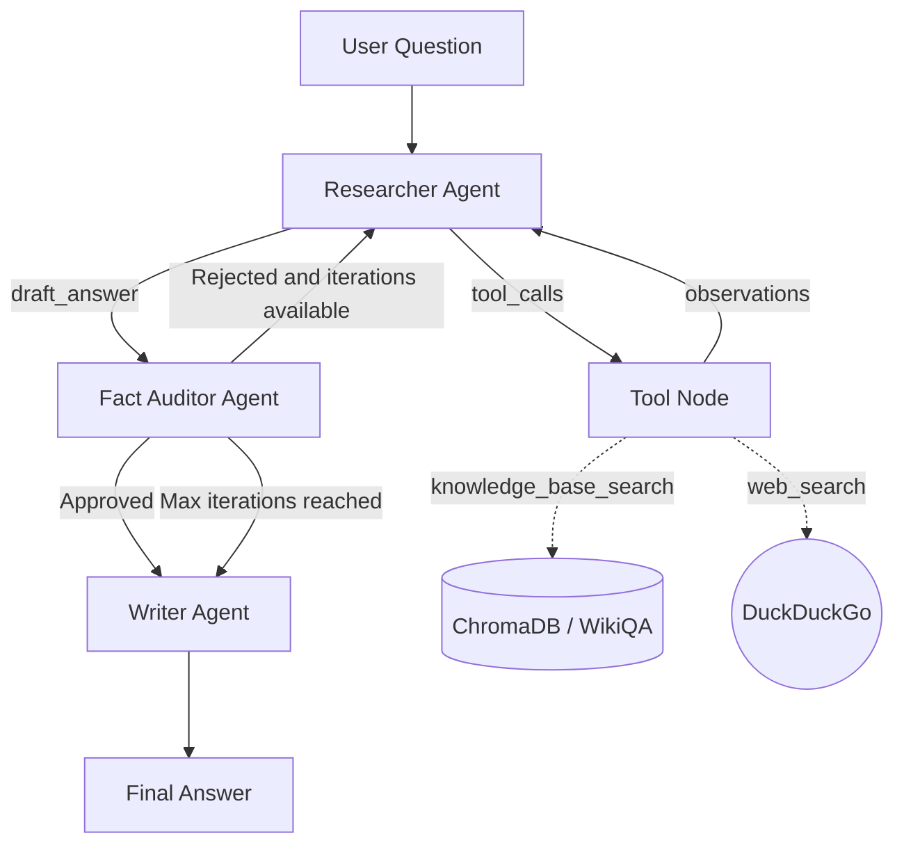

# Sistema Operativo de Agentes Cognitivos para Inteligencia Competitiva

**Multi-Agent ReAct con LangGraph** — Proyecto final de Arquitecturas de Modelos de Lenguaje.

Este repositorio implementa un sistema multi-agente autónomo basado en
ReAct, orquestado con LangGraph, sobre una base vectorial local (WikiQA) con
guardrails contra alucinaciones. El texto oficial del enunciado vive en
[`ENUNCIADO_PROYECTO.md`](ENUNCIADO_PROYECTO.md).

## Descripción

El sistema recibe una pregunta del usuario y la procesa mediante tres
agentes cooperando en un grafo de estados:

1. **Researcher Agent** recibe la pregunta del usuario y decide recupera evidencia de una base vectorial o de una búsqueda con DuckDuckGo y redacta un borrador de respuesta apoyado solo en esa evidencia.
2. **Fact Auditor Agent** evalúa cuantitativamente si el borrador está
   sustentado en el contexto (`evidence_score`, `hallucination_risk`) y
   decide aprobar, rechazar (volver al Researcher) o forzar el paso al
   Writer si se agotaron las iteraciones.
3. **Writer Agent** produce la respuesta final con evidencia citada, nivel
   de confianza y advertencias si corresponde.

Todo el flujo queda trazado con eventos ReAct (`Thought -> Action ->
Observation`) y el resultado se exporta en un formato listo para evaluación
con RAGAS / LLM-as-a-Judge.

## Arquitectura general

El proyecto está organizado en tres capas conceptuales:

| Capa | Responsabilidad |
|------|------------------|
| **Data & Retrieval Layer** | Dataset (WikiQA), embeddings, base vectorial (FAISS/ChromaDB), `retrieve_context()`, baseline Naive RAG. |
| **Multi-Agent Orchestration Layer** (este repositorio) | `AgentState`, Researcher/Fact Auditor/Writer Agents, grafo LangGraph, guardrails, trazabilidad, `multi_agent_rag()`. |
| **Evaluation Layer** | Evaluación de 50 consultas con RAGAS (Faithfulness, Answer Relevance, Context Precision), comparación Multi-Agent ReAct vs. Naive RAG. |

```
                 ┌───────────────────────────────────────────────┐
                 │              LangGraph StateGraph              │
                 │                                                 │
 pregunta ──────►│  researcher ──► auditor ──► route_after_audit   │
                 │      ▲               │        │      │          │
                 │      └───────────────┘        │      └──► writer│──► respuesta final
                 │   (rechazado, quedan          │  (aprobado o        + trace + eval_format
                 │      iteraciones)             │   max_iterations)
                 └───────────────────────────────────────────────┘
                          ▲                                    │
                          │ retrieve_context()                 │ convert_to_eval_format()
                          │                                    ▼
                 ┌──────────────────────┐              ┌──────────────────┐
                 │ Data & Retrieval     │              │ Evaluation Layer  │
                 │ Layer                │              │ RAGAS /           │
                 │ WikiQA + FAISS/Chroma│              │ LLM-as-a-Judge    │
                 │ Naive RAG baseline   │              │ vs Naive RAG      │
                 └──────────────────────┘              └──────────────────┘
```

Diagrama Mermaid del grafo interno (también en `docs/architecture.md`):


## Data & Retrieval Layer

Se utilizó el corpus público [WikiQA](https://huggingface.co/datasets/microsoft/wiki_qa) disponible en Hugging Face. Las columnas del dataset son:

* `question`: pregunta

* `question_id`: id de la pregunta

* `document_title`: título del documento

* `answer`: respuesta candidata para la pregunta

* `label`: etiqueta 0/1 que indica si la respuesta responde a la pregunta

Para cada `document_title` hay varias `answer`. Cada `answer` es bastante corta por lo que para la vectorización se optó por concatenar todos los `answers` que pertenecen a un mismo `document_title` y vectorizarlo como un único chunk. El código de creación de la base de conocimiento está en `src/retriever/retrieval_pipeline`.

- Se usó el modelo [`sentence-transformers/all-MiniLM-L6-v2` disponible en Hugging Face](https://huggingface.co/sentence-transformers/all-MiniLM-L6-v2) para vectorizar cada documento resultante. Los resultados tienen 384 dimensiones.

- Se usó la base de datos vectorial ChromaDB.


## Multi-Agent Orchestration Layer

- Grafo LangGraph con 3 nodos (`researcher`, `auditor`, `writer`) y una
  arista condicional (`route_after_audit`).
- `AgentState` tipado (`TypedDict`) compartido entre nodos.
- Guardrails cuantitativos independientes del LLM (`evidence_score`,
  `hallucination_risk`) con umbrales configurables.
- Ciclo de rechazo y corrección acotado por `MAX_ITERATIONS`.
- Trazabilidad ReAct corta y auditable en cada nodo.
- Interfaces desacopladas para retriever y LLM: **modo fallback** (desarrollo
  aislado, sin dependencias externas) y **modo real** (Data & Retrieval
  Layer / LLM local o Gemini).
- Salida estructurada lista para `convert_to_eval_format()` (Evaluation Layer).

## LLM: local, fallback o Gemini — no depende de una sola API

El enunciado prioriza inferencia local con un modelo mediano cuantizado
(Mistral-7B-Instruct o Llama-3-8B-Instruct en 4 bits). Por eso el módulo
expone una interfaz única, `generate_llm_response(prompt)`
(`src/llm/interface.py`), resuelta por `provider`:

| provider   | Módulo                    | Uso |
|------------|---------------------------|-----|
| `fallback` | `src/llm/fallback_llm.py` | Pruebas rápidas, sin GPU ni API keys (default). |
| `local`    | `src/llm/local_llm.py`    | **Modo principal de arquitectura**: Mistral-7B/Llama-3-8B cuantizado 4-bit. |
| `gemini`   | `src/llm/gemini_llm.py`   | Opcional, para desarrollo rápido sin GPU. |

Ningún agente importa un backend concreto: todos resuelven el proveedor
activo en `src/llm/interface.py::resolve_llm`. Gemini nunca es la única
opción del sistema.

## Instalación

```bash
git clone https://github.com/anamariaaccilio/pln-multi-agent-react-orchestrator.git
cd p2_multi-agent-react-orchestrator
python -m venv .venv && source .venv/bin/activate   # opcional
pip install -r requirements.txt
```

## Cómo correr — comandos exactos

**Terminal (rápido, modo fallback):**

```bash
python examples/run_multi_agent_demo.py
```

**Otros examples:**

```bash
python examples/integration_example_retriever.py
python examples/export_eval_format_demo.py
```

**Notebook (entrega):**

Abrir `notebooks/02_multi_agent_langgraph_pipeline.ipynb` en Jupyter, VS
Code o Google Colab. Importa todo desde `src/`, no duplica lógica.

Guía detallada paso a paso: [`docs/how_to_run.md`](docs/how_to_run.md).

```python
from src.retriever.interface import register_retriever, initialize
from retrieval_pipeline import retrieve_context  # función del Data & Retrieval Layer

register_retriever(retrieve_context)
initialize()

# construir grafo

from src.graph.build_graph import build_agent_graph
from src.graph.visualize import visualize_graph

compiled_graph = build_agent_graph()
print(visualize_graph(compiled_graph))

# llamar al sistema


from src.pipeline.multi_agent_rag import multi_agent_rag
result = multi_agent_rag("...", retriever=retrieve_context)
```

## Cómo entregar output al Evaluation Layer

```python
from src.pipeline.eval_format import convert_to_eval_format
eval_item = convert_to_eval_format(result)
```

Devuelve:

```python
{
    "question": "...",
    "answer": "...",
    "contexts": ["...", "..."],
    "system_type": "multi_agent_react",
    "audit_passed": True,
    "evidence_score": 0.82,
    "hallucination_risk": 0.18,
}
```

Detalle completo en [`docs/evaluation_interface.md`](docs/evaluation_interface.md).

## Estructura de carpetas

```
PLN_P2/
├── README.md
├── requirements.txt
├── .gitignore
├── ENUNCIADO_PROYECTO.md
├── config/settings.yaml
├── notebooks/
│   └── 02_multi_agent_langgraph_pipeline.ipynb
├── src/
│   ├── config.py
│   ├── agents/{state.py, prompts.py, researcher.py, auditor.py, writer.py}
│   ├── graph/{routes.py, build_graph.py, visualize.py}
│   ├── pipeline/{multi_agent_rag.py, eval_format.py}
│   ├── retriever/{interface.py, fallback_retriever.py}
│   ├── llm/{interface.py, fallback_llm.py, local_llm.py, gemini_llm.py}
│   └── utils/{trace.py, formatting.py}
├── examples/
│   ├── run_multi_agent_demo.py
│   ├── integration_example_retriever.py
│   └── export_eval_format_demo.py
├── outputs/{traces/, graph/, evaluation_ready/}
└── docs/{architecture.md, integration_with_retriever.md, evaluation_interface.md,
         how_to_run.md, defense_script.md, troubleshooting.md}
```

## Ejemplo de uso

```python
from src.pipeline.multi_agent_rag import multi_agent_rag
from src.pipeline.eval_format import convert_to_eval_format
from src.utils.trace import print_trace

result = multi_agent_rag("Cuando y por quien fue construida la Torre Eiffel?")

print(result["final_answer"])
print_trace(result)
print(convert_to_eval_format(result))
```

## Output esperado

```python
{
    "question": "Cuando y por quien fue construida la Torre Eiffel?",
    "retrieved_context": [{"content": "...", "source": "wikiqa_doc_0142", "score": 0.91}, ...],
    "draft_answer": "...",
    "audit_passed": True,
    "audit_feedback": "Aprobado: la respuesta esta razonablemente sustentada en el contexto.",
    "missing_info": "",
    "final_answer": "Respuesta final:\n...\n\nEvidencia usada:\n...\n\nNivel de confianza:\nAlto\n\nAdvertencia:\nNinguna.",
    "iterations": 1,
    "trace": [{"agent": "researcher", "thought": "...", "action": "...", "observation": "..."}, ...],
    "evidence_score": 0.82,
    "hallucination_risk": 0.18,
    "confidence_level": "Alto",
    "warnings": [],
    "system_type": "multi_agent_react",
}
```

## Métricas de evaluación

- **Propias del guardrail (Multi-Agent Orchestration Layer):** `evidence_score`,
  `hallucination_risk`, `audit_passed`, número de `iterations` usadas.
- **Externas (Evaluation Layer, vía `convert_to_eval_format`):** Faithfulness,
  Answer Relevance, Context Precision (RAGAS) o un score de LLM-as-a-Judge,
  comparadas contra el mismo set de preguntas corrido en el baseline Naive RAG.

## Analogía conceptual con Aprendizaje por Refuerzo

**No se entrena ningún agente con RL**; esto es solo una analogía para leer
el grafo con el vocabulario del curso:

| Concepto RL | Equivalente en este sistema |
|---|---|
| Estado | `AgentState`: pregunta, contexto, borrador, auditoría, iteraciones. |
| Acción | Recuperar, auditar, aprobar, rechazar, redactar. |
| Observación | Contexto recuperado y `audit_feedback` del Fact Auditor. |
| Política de control | `route_after_audit(state)` — determinista, no aprendida. |
| Recompensa proxy | Faithfulness / answer relevance y reducción de `hallucination_risk`, medidas por el Evaluation Layer. |
| Episodio | Una ejecución completa de `multi_agent_rag(question)`, de START a END. |

Detalle completo en [`docs/architecture.md`](docs/architecture.md) sección 6.

## Limitaciones

- `evidence_score` / `hallucination_risk` se calculan con una heurística
  léxica (superposición de vocabulario), no con un modelo NLI real: es un
  proxy simple, no una medida semántica completa.
- El LLM fallback no "aprende" del `audit_feedback` de forma inteligente
  (solo simula una corrección determinista); con un LLM real (local o
  Gemini) esto mejora porque el feedback se inyecta como parte del prompt.
- El grafo asume un flujo lineal de 3 agentes; no contempla agentes
  adicionales (por ejemplo, un agente planificador) fuera del alcance de
  este módulo.

## Trabajo futuro

- Sustituir la heurística léxica del Fact Auditor por un juez basado en NLI
  o en un segundo LLM (LLM-as-a-Judge interno, no solo el externo del
  Evaluation Layer).
- Persistir historial de trazas por sesión para análisis agregado de tasas
  de aprobación/rechazo.
- Agregar un cuarto agente opcional (por ejemplo, un Planificador que
  descomponga preguntas complejas antes del Researcher Agent).
- Cachear resultados de `retrieve_context` para preguntas repetidas dentro
  del mismo batch de evaluación.

## Documentación adicional

- [`docs/architecture.md`](docs/architecture.md) — arquitectura detallada y analogía con RL.
- [`docs/integration_with_retriever.md`](docs/integration_with_retriever.md) — contrato del retriever real.
- [`docs/evaluation_interface.md`](docs/evaluation_interface.md) — formato de entrega para evaluación.
- [`docs/how_to_run.md`](docs/how_to_run.md) — guía paso a paso.
- [`docs/defense_script.md`](docs/defense_script.md) — guion de exposición.
- [`docs/troubleshooting.md`](docs/troubleshooting.md) — errores comunes y soluciones.
